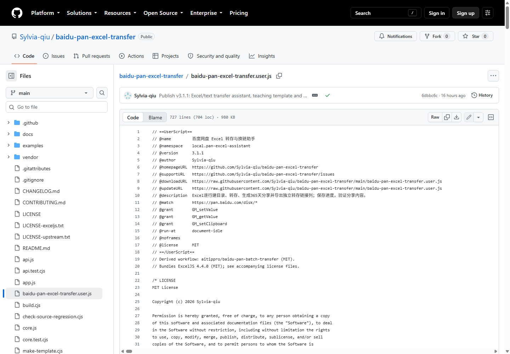

# 安装图解：从零开始，一步一步来

适用电脑端 Edge / Chrome。下方使用真实页面截图：扩展菜单来自 Edge，源码页来自 GitHub；执行权限配图引用 Tampermonkey 官方文档。不同浏览器版本的布局可能不同。安装完无需启动本地服务，也不用安装 Node.js。

## 第 1 步：先安装 Tampermonkey（油猴）

打开 [Tampermonkey 官网](https://www.tampermonkey.net/)，选择你正在使用的浏览器，再通过官网的下载入口进入对应扩展商店。点击“获取”或“添加至 Chrome”，按浏览器提示完成添加。

**完成标志：**浏览器扩展列表中能找到 Tampermonkey（中文可能显示“篡改猴”）。点击地址栏右侧的拼图形“扩展”图标：

在展开的列表中找到“篡改猴”，点击名称或左侧图标打开它的菜单；右边的三个点是浏览器对该扩展的管理菜单。

## 第 2 步：允许它运行用户脚本

在浏览器新标签页的地址栏中输入：

- Chrome：`chrome://extensions`
- Edge：`edge://extensions`

找到 Tampermonkey，进入“详情 / 管理扩展”。若有“允许用户脚本”（Allow User Scripts），将其开启。没有这个选项时，按 [Tampermonkey 官方权限指引](https://www.tampermonkey.net/faq.php?q=Q209)，在扩展管理页开启“开发者模式”。不同版本可能采用不同入口。

下图为 Tampermonkey 官方文档中的实际 Chrome 设置界面（英文版），红框标出 Allow User Scripts 开关。

图片来源：[Tampermonkey 官方权限说明](https://www.tampermonkey.net/faq.php?q=Q209)。Edge 的文字或布局可能不同。

**完成标志：**Tampermonkey 已启用，并已完成上述执行权限设置。

## 第 3 步：安装转存助手

点击 **[安装 / 查看完整脚本源码](https://raw.githubusercontent.com/Sylvia-qiu/baidu-pan-excel-transfer/main/baidu-pan-excel-transfer.user.js)**。

如果 Tampermonkey 弹出安装页，确认名称是“百度网盘 Excel 转存与换链助手”，点击“安装”。已装旧版时，优先更新原脚本。

**完成标志：**Tampermonkey 的“管理面板”中出现此脚本，状态为启用。

**如果看到一整屏代码，并不一定是出错了。** 按下面的方法手动安装即可。

### 只看到源码？在哪里复制、粘贴？

**拿到完整源码，有两种入口，任选一种：**

1. 最直接：打开上面的 [完整源码直达链接](https://raw.githubusercontent.com/Sylvia-qiu/baidu-pan-excel-transfer/main/baidu-pan-excel-transfer.user.js)。如果进入的是纯代码页面，点击代码区域，按 **Ctrl+A → Ctrl+C**，复制全部代码。
2. 从仓库进入：打开 [GitHub 仓库首页](https://github.com/Sylvia-qiu/baidu-pan-excel-transfer)，点击文件 **`baidu-pan-excel-transfer.user.js`**，再点击代码区域上方的 **Raw**，进入纯代码页面后按 **Ctrl+A → Ctrl+C**。浏览器若将 Raw 下载为文件，可用文本编辑器打开下载的 `.user.js` 文件，再全选复制。

要复制的是整个 **`baidu-pan-excel-transfer.user.js`** 文件，不是 README，不是单独的 `app.js`，也不是浏览器地址栏中的网址。代码开头应能看到 `// ==UserScript==`；后面代码很多是正常的，里面包含 Excel 处理库。

下面是本项目脚本文件的真实页面：**Raw 在代码区域右上方**，紧挨着复制和下载图标。点击图片可放大查看。

**然后把源码放进 Tampermonkey：**

1. 点击浏览器工具栏的 Tampermonkey 图标，选择“添加新脚本”（或进入管理面板后点击新建入口）。
2. 点击代码编辑区，按 **Ctrl+A** 选中默认代码，再按 **Ctrl+V** 粘贴刚才复制的完整源码。
3. 按 **Ctrl+S** 保存。如果是更新已安装的脚本，直接在管理面板打开原脚本的编辑页，全选替换并保存，避免启用两份相同脚本。
4. 回到管理面板，确认脚本名称正确、已启用。

## 第 4 步：打开百度网盘，让助手出现

打开 [百度网盘文件页](https://pan.baidu.com/disk/main)，登录自己的账号，再刷新页面。这里要打开的是**自己的网盘文件页**，不是别人发来的分享页，也不是 GitHub 页面。

**完成标志：**页面右上角出现“百度网盘转存与换链助手”，能看到“Excel 导入”和“粘贴分享文本”。

没有面板时，先确认第 2 步的执行权限、脚本启用状态，以及 Tampermonkey 对当前百度网盘页面的访问权限，再刷新一次。

## 第 5 步：下载模板，填入自己的任务

在助手的“Excel 导入”页点击 **“下载 Excel 模板”**。填写原始链接和转存路径，例如 `/资源/第一部剧`，每行可用不同目录。提取码放在原始链接或分享文案中。

模板第二行是教学示例，按序号栏的“教学示例（不处理）”标记跳过，**不是固定跳过第二行**。保留它就从下一行填写；删除它后，新的第二行正常处理。直接改写示例行时，也要把序号改成自己的编号。

备注右侧可以追加文字列，处理时忽略，导出时保留。填好后保存为 `.xlsx`。

## 第 6 步：导入、核对、开始

点击“选择文件”，导入刚保存的 Excel，核对清单中的任务和目标目录，勾选要处理的行，然后点击 **“开始处理选中项”**。选择文件本身不会开始转存。

完成后点击新链接即可复制，也可以“导出结果 Excel”。新“转存链接”是原始链接右侧的独立列；失败、待核验或未完成的行留空。原始链接、备注和附加文字列会保留。

运行期间保持页面打开。暂停、失败重试和恢复进度的方法见 [操作手册](USER_GUIDE.md)。
